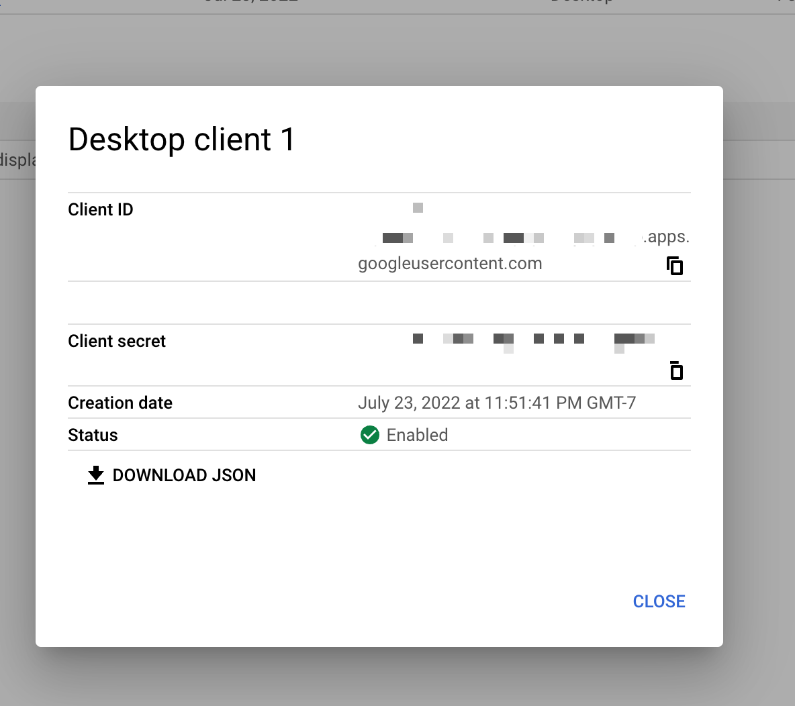

Gmail utilities.

## Developer

Before running, please follow [this link](https://developers.google.com/workspace/guides/create-credentials#desktop-app) to download the JSON credentials and renamed to `credentials.json` in the repo root dir before using.

The download file link will look like somehting like
https://console.cloud.google.com/apis/credentials?project=<project_id>

Remember to update the project_id with yours.



To run

```sh

git clone https://github.com/xinbenlv/gmail-utils.git
cd gmail-utils
npm i
npm start # runs the query, wait for a while, 10min~
npm run da
```


## Trouble shooting

1. If you got this error `invalid_grant`, it means your permission is expired. You need to re-authenticate.

```text
npm start

> zzn-gmail-utils@1.0.0 start
> npx ts-node index.ts

dirName = ./output
Done creating table
done
Known Msgs number = 35985
Error: invalid_grant
    at Gaxios._request (/Users/zzn/ws/@xinbenlv/gmail-utils/node_modules/gaxios/src/gaxios.ts:117:15)
    at processTicksAndRejections (node:internal/process/task_queues:95:5)
    at OAuth2Client.refreshTokenNoCache (/Users/zzn/ws/@xinbenlv/gmail-utils/node_modules/google-auth-library/build/src/auth/oauth2client.js:172:21)
    at OAuth2Client.getRequestMetadataAsync (/Users/zzn/ws/@xinbenlv/gmail-utils/node_modules/google-auth-library/build/src/auth/oauth2client.js:259:17)
    at OAuth2Client.requestAsync (/Users/zzn/ws/@xinbenlv/gmail-utils/node_modules/google-auth-library/build/src/auth/oauth2client.js:332:23)
    a
```

Don't forget to download client credentials,
Delete `token.json` (which will reauthenticate) and

run the following to re-authenticate
```sh
gcloud auth login
```
Don't forget to copy the code from URL which will look somethingl like `4/0ATx3LY6In-sRZqkLEemPbiO64QR-Ql6qs6Ar2WAhWTMiJWiHhu0QfYAHm2EfqO0XA5yIRw` from the URL below

```text
http://localhost:3000/?code=4/0ATx3LY6In-sRZqkLEemPbiO64QR-Ql6qs6Ar2WAhWTMiJWiHhu0QfYAHm2EfqO0XA5yIRw&scope=https://www.googleapis.com/auth/gmail.readonly
```